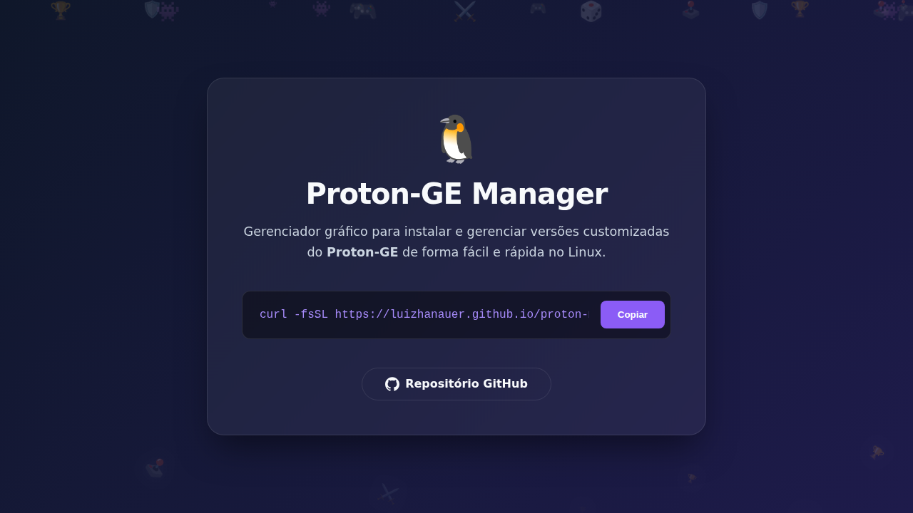

<p align="center">
  <!-- Você pode criar uma logo e colocar o link aqui -->
  
  <h1 align="center">🎮 Proton Manager</h1>
</p>

<p align="center">
  Um gerenciador gráfico simples e elegante para instalar e gerenciar versões customizadas do Proton (como o Proton-GE) no seu Linux.
</p>

<p align="center">
  <!-- Badges (substitua 'luizhanauer/proton-manager' se o repositório for outro) -->
  
  
  
</p>

<p align="center">
  <!-- Adicione um screenshot da sua aplicação aqui! -->
  
</p>

## 📖 Sobre o Projeto

O **Proton Manager** nasceu da necessidade de simplificar a instalação e o gerenciamento de diferentes versões do Proton, especialmente as customizadas como o popular **Proton-GE**. Em vez de lidar com comandos no terminal e extração manual de arquivos, esta aplicação oferece uma interface gráfica limpa e intuitiva para que qualquer usuário possa manter suas ferramentas de compatibilidade da Steam atualizadas com poucos cliques.

Construído com **Go** e **Wails (com Vue.js)**, o Proton Manager é leve, rápido e nativo para o seu sistema.

## ✨ Funcionalidades

- **Listagem Automática:** Busca e exibe as últimas versões disponíveis no registro do Proton-GE.
- **Instalação com 1-Clique:** Baixa e extrai a versão selecionada diretamente na pasta correta da Steam.
- **Gerenciamento Simples:** Identifica versões já instaladas e permite a remoção com um único clique.
- **Interface Moderna:** Tema escuro com detalhes em verde neon, pensado para se integrar ao setup gamer.
- **Atalho para Pasta:** Abra a pasta de ferramentas de compatibilidade da Steam diretamente pela aplicação.
- **Leve e Rápido:** Feito em Go, garantindo performance e baixo consumo de recursos.

## 🚀 Instalação

A forma mais fácil de instalar é baixando a última versão diretamente da nossa [**página de Releases**](https://github.com/luizhanauer/proton-manager/releases).

1.  Vá para a [página de Releases](https://github.com/luizhanauer/proton-manager/releases).
2.  Baixe a última versão do arquivo `proton-manager`.
3.  Dê permissão de execução para o arquivo:
    ```bash
    chmod +x proton-manager
    ```
4.  Execute a aplicação:
    ```bash
    ./proton-manager
    ```

## 🛠️ Como Usar

1.  Abra a aplicação. Ela irá buscar automaticamente as versões disponíveis.
2.  As versões já instaladas no seu sistema serão indicadas.
3.  Clique em **"Instalar"** para baixar uma nova versão.
4.  Clique em **"Remover"** para desinstalar uma versão existente.
5.  **Importante:** Após instalar ou remover uma versão, **reinicie a Steam** (ou Heroic, Lutris, etc.) para que as alterações sejam reconhecidas.

---

## Contribuição

Contribuições são bem-vindas! Se você encontrar algum problema ou tiver sugestões para melhorar a aplicação, sinta-se à vontade para abrir uma issue ou enviar um pull request.

Se você gostou do meu trabalho e quer me agradecer, você pode me pagar um café :)

<a href="https://www.paypal.com/donate/?hosted_button_id=SFR785YEYHC4E" target="_blank"></a>

## Licença

Este projeto está licenciado sob a Licença MIT. Consulte o arquivo LICENSE para obter mais informações.

<p align="center">Desenvolvido por <strong>Luiz Hanauer</strong></p>
